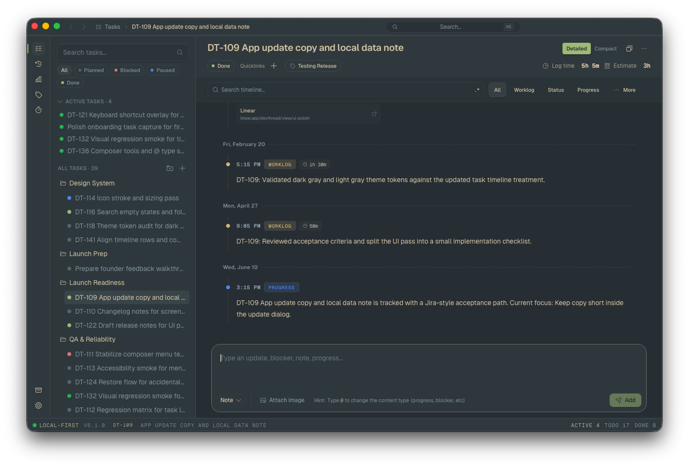
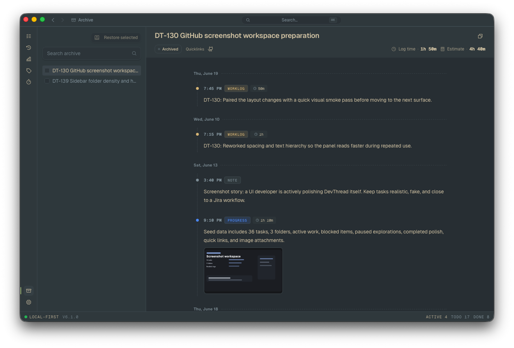
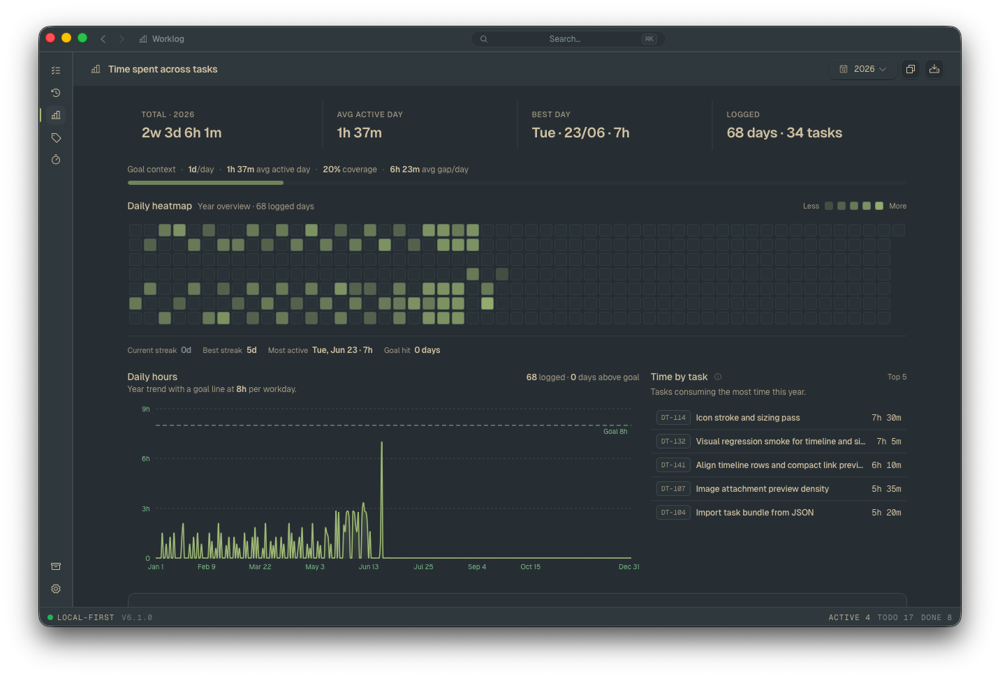
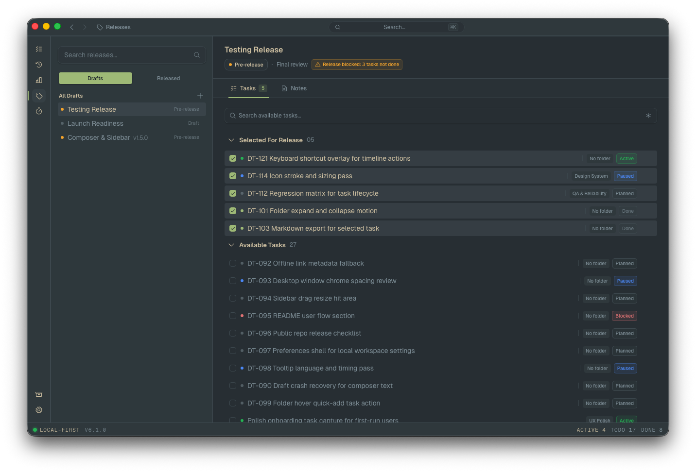
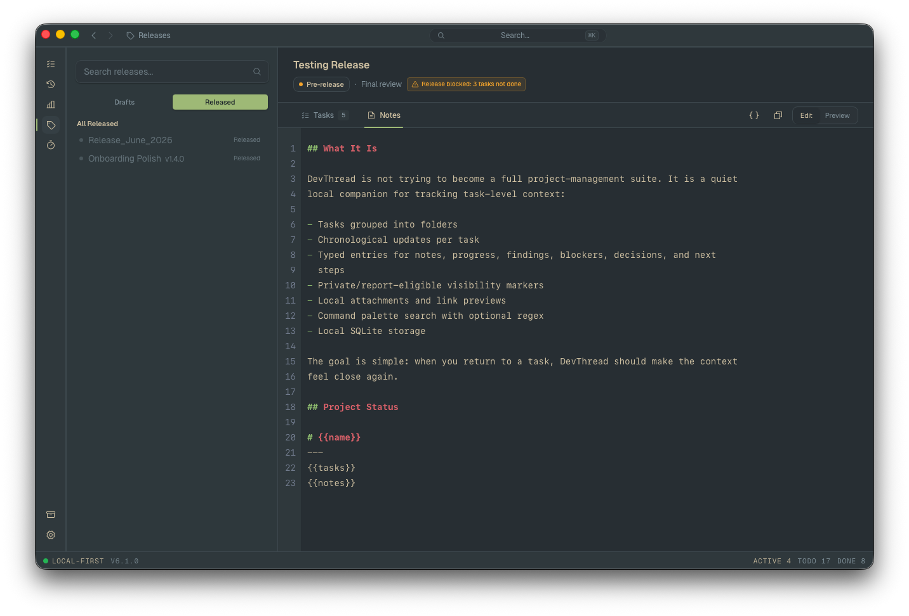
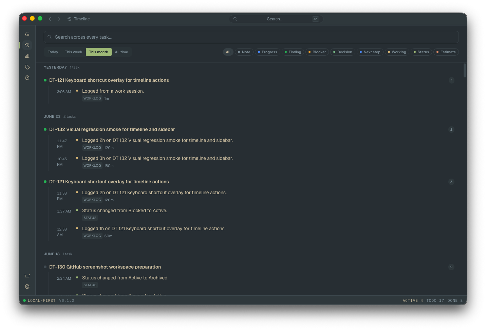
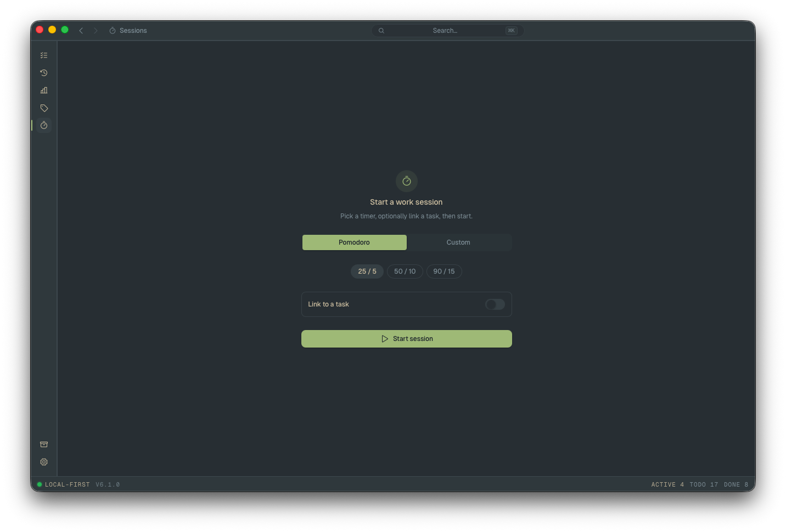

# DevThread

DevThread is a local-first desktop work journal for developers.

It is built for the space between "project management" and "I left myself a
note somewhere." DevThread helps you keep task-level context close: what changed,
why it changed, what blocked you, which links mattered, what you logged, and what
you need to remember when you return later.

DevThread is early-alpha software. It is usable for dogfooding, but the product
shape, data model, release flow, and documentation are still changing.

## Contents

- [Why DevThread Exists](#why-devthread-exists)
- [What It Does](#what-it-does)
- [Screenshots](#screenshots)
- [How It Compares](#how-it-compares)
- [Project Status](#project-status)
- [Tech Stack](#tech-stack)
- [Development](#development)
- [Local Data](#local-data)
- [Releases](#releases)
- [Roadmap](#roadmap)
- [Contributing](#contributing)
- [Security And Privacy](#security-and-privacy)
- [License](#license)

## Why DevThread Exists

Most engineering context is not a ticket.

It is the half-finished investigation, the link you opened at 1 AM, the small
decision you made after reading code, the screenshot that explained a bug, the
blocker you forgot to mention, or the exact thing you need to do next.

Tools like Jira, Linear, GitHub Issues, Slack, and pull requests are excellent
for coordination. They are not always great as a private, fast, local memory for
the developer doing the work. DevThread exists for that personal layer.

The goal is simple: when you return to a task, the context should feel close
again.

## What It Does

- **Task threads**: keep chronological updates per task instead of scattered
  notes.
- **Folders**: group active work into lightweight areas without creating a full
  project-management hierarchy.
- **Typed updates**: record notes, progress, findings, blockers, decisions, next
  steps, worklogs, status changes, and estimates.
- **Timeline-first memory**: every useful bit of context lives where it happened.
- **Local attachments and link previews**: keep screenshots and references next
  to the update that made them relevant.
- **Command palette search**: quickly find tasks, folders, releases, and
  timeline entries from anywhere, with back/forward navigation history
  (`⌘[` / `⌘]`) once you jump.
- **Archive view**: move finished or stale work out of the active workspace
  without deleting the history.
- **Worklog view**: see where time is going across tasks and days.
- **Global timeline**: a single cross-task activity feed — grouped by day,
  then by task — for "what did I actually do" recall without opening every
  task one by one. Filterable by entry type and time range (Today / Week /
  Month / All).
- **Work sessions**: a focus timer (Pomodoro presets or custom work/rest
  minutes), optionally linked to a task. Runs in the background with a
  status pill in the title bar while you work elsewhere, and logs completed
  focus time straight into that task's worklog. Native OS notifications on
  phase changes.
- **Release view**: collect tasks into release notes with a simple Markdown
  editor and preview flow, with a clean Drafts/Released split and read-only
  protection once a release ships.
- **13 themes**: a curated set of dark and light themes (Dracula, Gruvbox,
  Nord, Tokyo Night, and more), plus Catppuccin Mocha, Everforest, and
  Kanagawa available to trial.
- **Local SQLite storage**: your working memory is stored locally by default.

DevThread is intentionally not trying to become a company-wide planning tool.
It is a quiet companion for individual engineering context.

## Screenshots

<details open>
<summary><strong>Task Timeline</strong></summary>



</details>

<details>
<summary><strong>Archive View</strong></summary>



</details>

<details>
<summary><strong>Worklog View</strong></summary>



</details>

<details>
<summary><strong>Release Tasks</strong></summary>



</details>

<details>
<summary><strong>Release Notes</strong></summary>



</details>

<details>
<summary><strong>Global Timeline</strong></summary>



</details>

<details>
<summary><strong>Work Sessions</strong></summary>



</details>

## How It Compares

DevThread is not a replacement for Jira, Linear, GitHub Issues, or Slack. It
sits beside them.

| Tool          | Best For                                                 | Where DevThread Fits                                                                                     |
| ------------- | -------------------------------------------------------- | -------------------------------------------------------------------------------------------------------- |
| Jira          | Planning, reporting, process, organization-wide tracking | DevThread keeps the private day-to-day context behind the ticket.                                        |
| Linear        | Fast team issue tracking and product execution           | DevThread captures the messy investigation and personal notes that do not belong in every issue comment. |
| GitHub Issues | Open-source issue discussion and code-adjacent tracking  | DevThread tracks your local working thread across links, screenshots, worklogs, and next steps.          |
| Slack/Teams   | Conversation and coordination                            | DevThread preserves the useful result after the conversation scrolls away.                               |
| Notes apps    | Free-form writing and references                         | DevThread anchors notes to tasks, timelines, worklogs, and release context.                              |

Use DevThread when you want:

- a private memory of how a task actually unfolded;
- a lightweight local task journal, not a process-heavy workspace;
- context you can search later without digging through chat, tickets, and tabs;
- release notes that are assembled from real task work instead of reconstructed
  from memory.

## Project Status

DevThread is currently **early alpha**.

Expect rough edges. Some workflows are still being shaped, especially release
polish, archive behavior, themes, installers, signing, and documentation. The
app is being built in public, and feedback is welcome.

Back up any dogfood data you care about before relying on DevThread for
important work history.

## Tech Stack

- Tauri 2
- React 19
- TypeScript
- Rust
- SQLite
- CodeMirror
- Radix UI
- Tailwind CSS
- Phosphor Icons
- Vitest

## Development

Requirements:

- Node.js 22+
- pnpm 11+
- Rust stable
- Tauri 2 system dependencies for your platform

Install dependencies:

```bash
pnpm install
```

Run the desktop app in development:

```bash
pnpm dev
```

Run the web shell only:

```bash
pnpm dev:web
```

Useful checks:

```bash
pnpm format:check
pnpm check
pnpm test
pnpm test:rust
pnpm build
```

Format the repo:

```bash
pnpm format
```

## Local Data

DevThread stores its SQLite database in the operating system's normal
application-data directory as `devthread.sqlite3`.

Because this is alpha software, back up any dogfood data you care about. See
[`docs/dogfood/backup-and-recovery.md`](docs/dogfood/backup-and-recovery.md)
before relying on DevThread for important work history.

App updates replace the installed application bundle only. They do not delete or
rewrite the local `devthread.sqlite3` database.

## Demo Data

The desktop package includes a seed script for local demo data:

```bash
pnpm --filter @devthread/desktop seed:demo
```

Use this when preparing screenshots, demos, or feedback videos.

## Releases

CI lives in [`.github/workflows/build.yml`](.github/workflows/build.yml). It
runs formatting checks, typechecks, tests, and cross-platform Tauri builds.

On `release_v_*` tags, the release job uploads generated installers and binaries
to a GitHub Release, including signed updater artifacts and `latest.json` for
the in-app update checker:

- macOS Apple Silicon `.dmg`
- Windows `.msi` and NSIS `.exe`
- Linux `.deb` and `.AppImage`

To cut a release:

1. Bump the version in `apps/desktop/package.json` and
   `apps/desktop/src-tauri/tauri.conf.json`.
2. Commit the version bump.
3. Create and push a release tag, for example `release_v_0.1.0_alpha`.

Installers are currently unsigned. macOS Gatekeeper and Windows SmartScreen may
show first-run warnings until signing and notarization are wired up.

In-app updates use Tauri's signed updater. Before cutting a public release, add
these repository secrets:

- `TAURI_SIGNING_PRIVATE_KEY`: the private key generated by
  `pnpm --filter @devthread/desktop tauri signer generate --ci -w <path>`
- `TAURI_SIGNING_PRIVATE_KEY_PASSWORD`: optional; leave unset if the generated
  key has no password

Never commit the private signing key. The public key is safe to commit and is
stored in `apps/desktop/src-tauri/tauri.conf.json`.

## Roadmap

Near-term focus:

- tighter task and archive workflows;
- safer release and archive lifecycle rules;
- improved installer signing and update confidence;
- better screenshot, attachment, and link-preview polish;
- documentation for backup, restore, and contributor setup.

## Contributing

DevThread is still finding its product shape, so the best contributions are
small, practical, and easy to review:

- bug reports with clear reproduction steps;
- UI polish fixes that preserve the local, editor-like workflow;
- tests for existing behavior;
- documentation improvements;
- focused fixes for release/build issues.

Please keep changes scoped. Large product-direction changes should start as an
issue or discussion first.

Before opening a pull request, run:

```bash
pnpm format:check
pnpm check
pnpm test
pnpm test:rust
```

## Security And Privacy

DevThread is local-first and stores its core data locally. Still, this is alpha
software. Do not store secrets, credentials, customer data, or regulated data in
DevThread unless you have reviewed the storage and backup behavior for your own
risk level.

If you find a security issue, please avoid posting sensitive details publicly.
Open a minimal issue asking for a private contact path until a dedicated
security policy exists.

## License

License information will be added before the first public alpha release.
